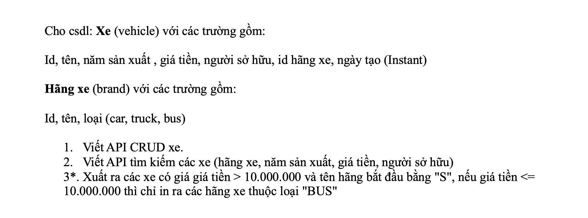
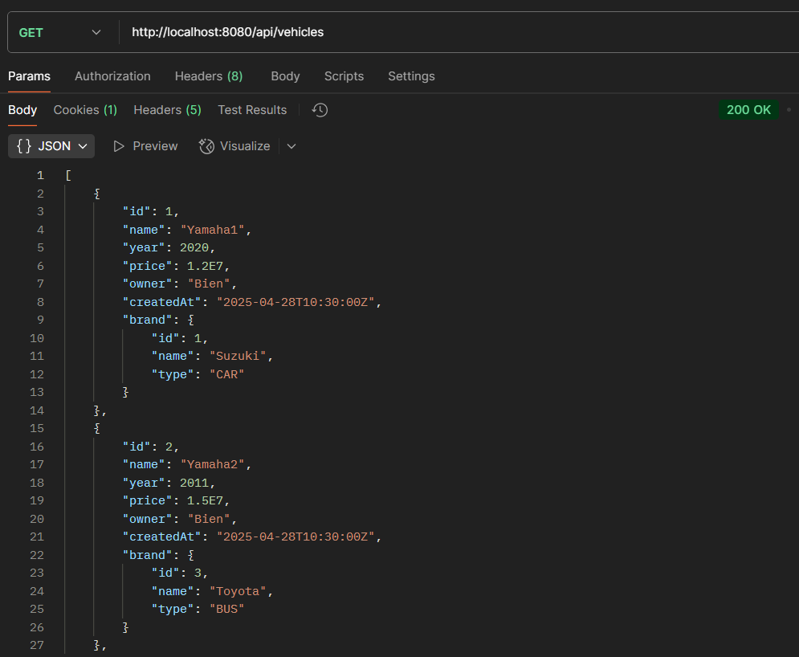
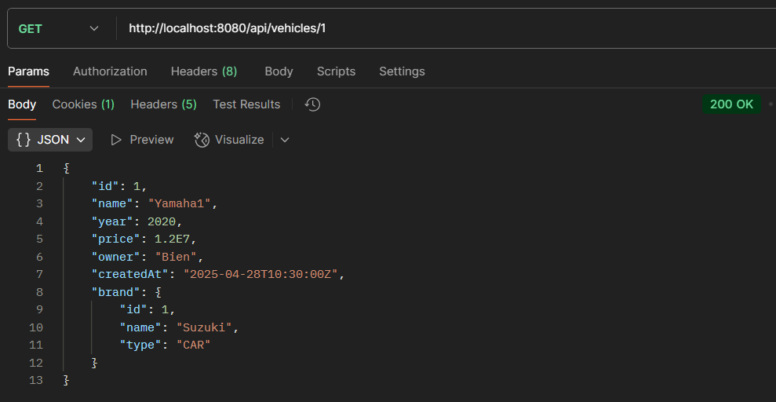
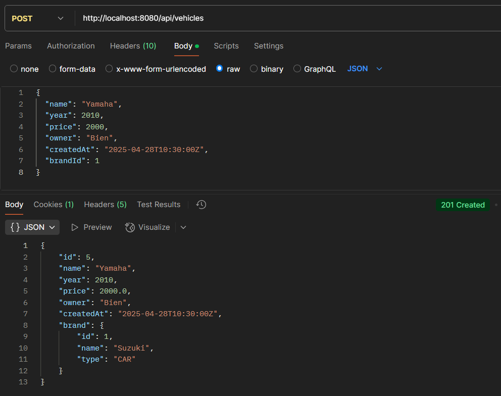
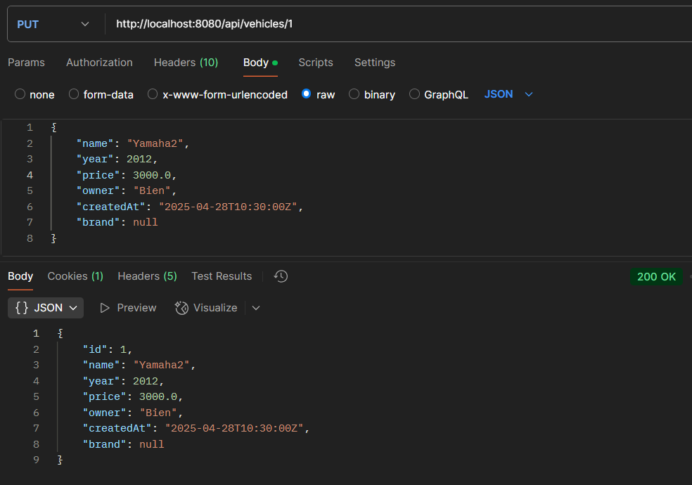
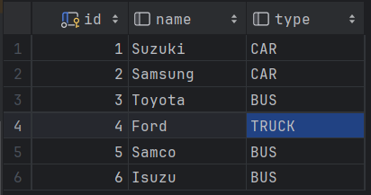
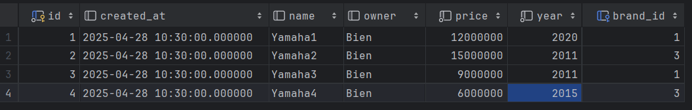
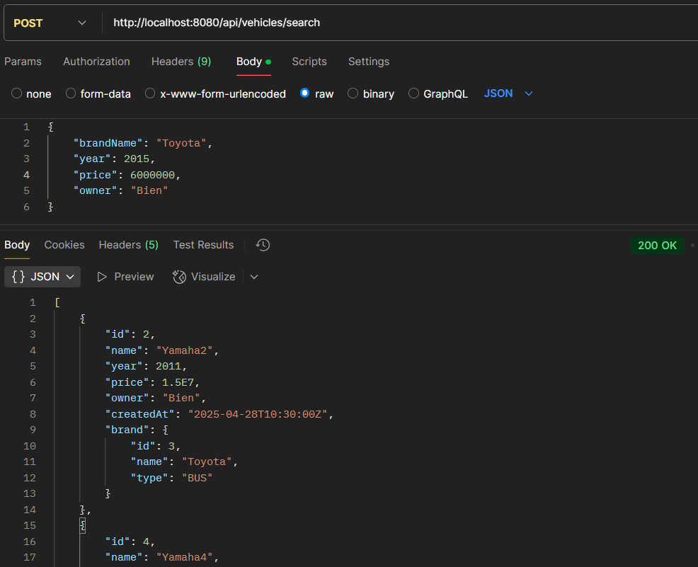
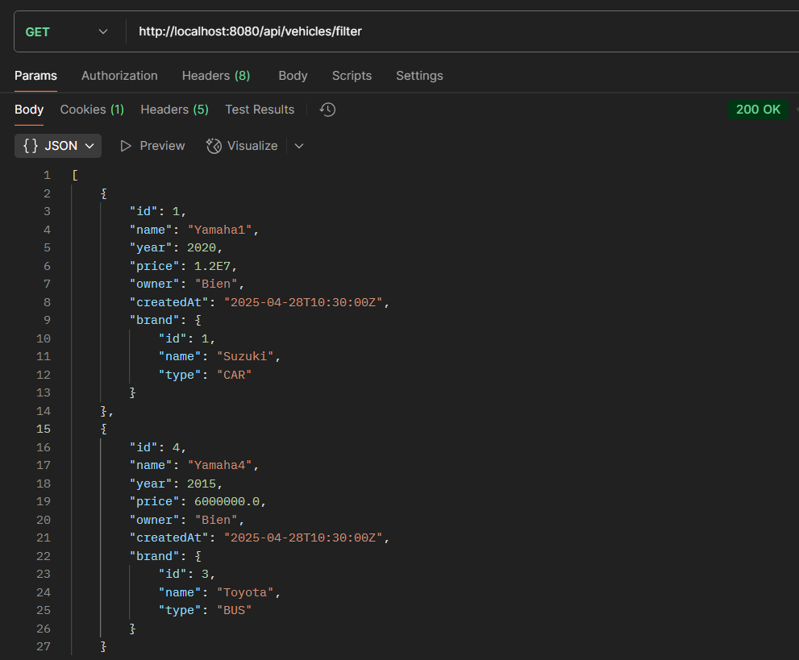

## 1. Viết API CRUD xe
[GET] /api/vehicles

[GET] /api/vehicles/{id}

[POST] /api/vehicles

[PUT] /api/vehicles/{id}

[DELETE] /api/vehicles/{id}

## 2. Viết API tìm kiếm các xe (hãng xe, năm sản xuất, giá tiền, người sở hữu)
* Dữ liệu mẫu bảng brand

* Dữ liệu mẫu bảng vehicle

[POST] /api/vehicles/search

## 3. Xuất ra các xe có giá giá tiền > 10.000.000 và tên hãng bắt đầu bằng "S", nếu giá tiền <= 10.000.000 thì chỉ in ra các hãng xe thuộc loại "BUS"

[GET] /api/vehicles/filter

